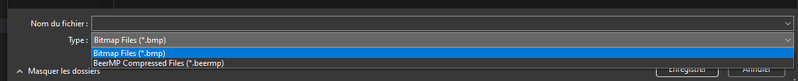

# PINTE

[](resources/logo.png)

* This is a programming school project for the 2nd year at ESILV Paris.
* Pinte is an application that lets you perform operations on bmp images.

## Run
To run the Pinte (created using WPF), just execute the following command in the root directory of the project: 
```bash
$ dotnet run --project PinteUI
```

## Tests
We have static tests in place to avoid regressions. To run them, execute the following command in the root directory of the project:
```bash
$ dotnet test
```
Our tests are mainly based on operations on images. We compare the result of the operation with a reference image. If the two images are different, the test fails.

## Debug Console
WPF Apps don't have console output.
This is why we created a debug console that can be used to display debug information.
To enable it, just execute the following command in the root directory of the project:
```bash
$ dotnet run --project PinteUI --debug
```

## Compression
We implemented a compression algorithm. The file extension is .beermp for the compressed files, they keep the same structure as the bmp files, but the matrix is replaced by a huffman tree and the huffman matrix.
You can select the read/write mode when opening/saving a file via the file format selector
[](resources/fileformatselector.png)


