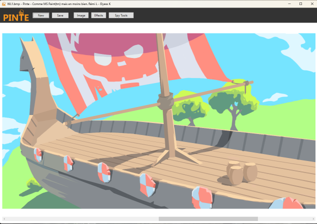

# PINTE

[](resources/logo.png)

* This is a programming school project for the 2nd year at ESILV Paris.
* Pinte is an application that lets you perform operations on bmp images.

## Run
To run the Pinte (created using WPF), just execute the following command in the root directory of the project: 
```bash
$ dotnet run --project PinteUI
```

[](resources/pinte_screen.png)

## Tests
We have static tests in place to avoid regressions. To run them, execute the following command in the root directory of the project:
```bash
$ dotnet test
```
Our tests are mainly based on operations on images. We compare the result of the operation with a reference image. If the two images are different, the test fails.

## Debug Console
WPF Apps don't have console output.
This is why we created a debug console that can be used to display debug information.
To enable it, just execute the following command in the root directory of the project:
```bash
$ dotnet run --project PinteUI --debug
```

## Compression
We implemented a compression algorithm. The file extension is .beermp for the compressed files, they keep the same structure as the bmp files, but the matrix is replaced by a huffman tree and the huffman matrix.
You can select the read/write mode when opening/saving a file via the file format selector
[](resources/fileformatselector.png)


## BMP Bombs
Most of the BMP implementations do have limits in place to avoid images with huge sizes, 
Not having those will make you vulnerable to DoS attacks. Historically, in low level languages like C/C++, tons of memory vulnerabilities were based on giving a program fake dimensions, but this is not relevant for c#.
Our project handle safely images of huge size by applying safe-by-default settings (can be removed/updated by the user).
We included a "Create BMP Bomb" in the Spy Tools menu, it allows you to create a file with huge dimensions to perform DoS attacks on other BMP projects (only for educational purposes ;) ).